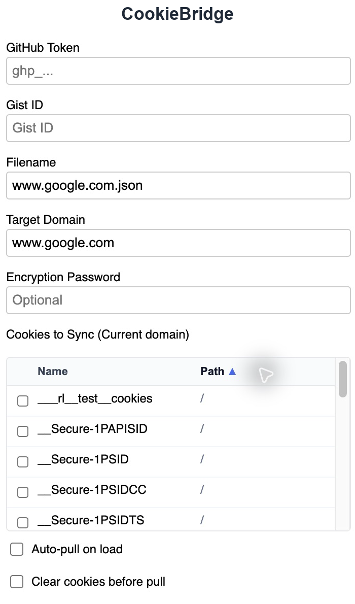
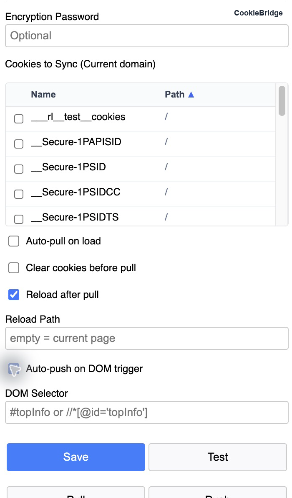
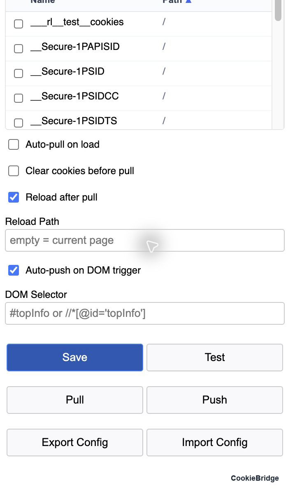

# CookieBridge - Private Cookie Sync

**English** | [中文](README.md)

Back up cookies for a given domain to a GitHub Gist, and pull them back into the browser when needed.

- Version: 1.12 (Manifest V3)
- Works on: Chrome / Edge and other Chromium-based browsers

---

## 1. Install

1. Open `chrome://extensions/`.
2. Turn on **Developer mode** in the top-right corner.
3. Click **Load unpacked** and select this folder (the one containing `manifest.json`).
4. After editing the code, go back to that page and click **Reload** on the extension card, then reopen the popup.

## 2. Screenshots

### Basic settings and Cookies to Sync

### Reload after pull, DOM trigger

### Action buttons

> Chrome Web Store listing assets live in [`store/`](store/): 1280x800 screenshots, a 440x280 small tile and a 1400x560 marquee, all 24-bit PNG with no alpha channel. The listing copy and privacy answers are in [`store/README.md`](store/README.md).

## 3. First-time setup

Click the toolbar icon to open the popup, then fill in the fields from top to bottom:

| Field | Description |
| --- | --- |
| GitHub Token | A Personal Access Token with `gist` scope, e.g. `ghp_...`. |
| Gist ID | The Gist that stores the cookie file (the last segment of the Gist URL). |
| Filename | File name inside the Gist, e.g. `www.google.com.json`. Use a different file per domain. |
| Target Domain | The domain you are configuring, e.g. `www.google.com`. Each domain keeps its own settings. |
| Encryption Password | Encryption passphrase. **Empty = no encryption.** Push and Pull must use the same value. |

Click **Save** when done. Changing Target Domain automatically loads the settings already saved for that domain.

## 4. Cookies to Sync

The list shows every cookie for the current domain, in two columns:

- **Name**: cookie name
- **Path**: cookie path (shown as `/` when not set)

Behaviour:

- Click the **Name** or **Path** header to sort; `▲` / `▼` means ascending / descending. Click the same header again to flip the direction.
- Sorting never drops your checked rows.
- **Checked = sync only those cookies.** Nothing checked = sync all cookies for the domain.
- The list only shows cookies for the domain of the active tab. If the current page is not the Target Domain, you will see `Navigate to <domain> to select cookies.` — open the popup on that domain instead.

## 5. Options

| Option | What it does |
| --- | --- |
| Auto-pull on load | Automatically pulls when a matching domain page loads. A sessionStorage flag prevents a pull → reload → pull loop. |
| Clear cookies before pull | Deletes existing cookies for the current domain (including registrable parent domains) before importing, so old and new cookies do not mix. |
| Reload after pull | Reloads the page after a successful pull. |
| Reload Path | Used with the option above. Empty = reload the current page; `/xxx` resolves as a path on the current site; a full `http(s)://` URL also works. Only HTTP/HTTPS is accepted. |
| Auto-push on DOM trigger | Pushes once when the specified element appears, then stops watching. |
| DOM Selector | The trigger selector. **Both CSS and XPath are supported**, e.g. `#topInfo` or `//*[@id='topInfo']`. Elements that appear only after navigation or delayed rendering are supported (a MutationObserver watches the DOM), and stray quotes or escaped characters from copy/paste are cleaned up automatically. |

## 6. Buttons

| Button | What it does |
| --- | --- |
| Save | Saves the global settings (Token / Gist ID / password) and the current domain settings. |
| Test | Checks that the GitHub Token and Gist ID work. |
| Pull | Fetches cookies from the Gist and writes them into the browser, applying the clearing and reload options above. |
| Push | Encrypts the current domain cookies and writes them to the Gist. |
| Export Config | Exports all settings as JSON. |
| Import Config | Imports a JSON settings file. |

## 7. Security notes

- The GitHub Token and the encryption passphrase are stored in plain text in `chrome.storage.local`. Do not use this on a shared computer.
- Make the Gist **Secret** and set an **Encryption Password**.
- Cookies are equivalent to login credentials. Verify the recipient before exporting or sharing a config.

## 8. FAQ

**No cookies in the list?**
The active tab's domain does not match Target Domain. Switch to that domain and reopen the popup.

**DOM trigger never fires?**
Verify the selector in the DevTools Console first: `document.querySelector('your selector')` for CSS, `$x("your XPath")` for XPath. XPath must start with `//` or `(`.

**Nothing reloads after Pull?**
Check that `Reload after pull` is ticked. If you filled in `Reload Path`, make sure it is a reachable HTTP/HTTPS URL.

**Decryption failed?**
Push and Pull used different passphrases, or that Gist file was never encrypted with the current passphrase.

**No settings found for this domain?**
No settings have been saved for this domain (or a parent domain) yet. Fill in the popup and click Save first.
